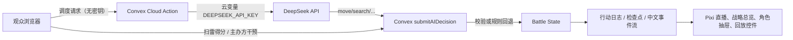

# AI 大逃杀实施架构与验收

最后更新：2026-08-07。本文档描述当前实现，不把已上线的能力重新写成待办。

## 产品边界

- **直播跟随**是默认入口：Pixi 战场、角色活动、弹道与中文公屏不被总览遮挡。
- **战略总览**提供 13 区状态、资源、任务、热度、干预点和参赛者入口；点击区域或角色可切回直播镜头。
- DeepSeek 由 Convex Action 调用。密钥只存在云变量 `DEEPSEEK_API_KEY`，永不发送给浏览器、数据库、日志或公屏；浏览器只持有不含敏感信息的调度租约标识。
- Convex 是比赛规则、行动校验、种子 RNG、状态迁移和事件播报的唯一权威；导播、抽屉打开状态和回放时间均是本地观众偏好。

## 运行时数据流

## 已运行架构

| 层级 | 权威模块 | 当前行为 |
| --- | --- | --- |
| 比赛规则 | `convex/aiTown/battleRoyale.ts` | 统一执行模型动作和规则 AI 回退；校验角色、冷却、距离、物品、区域邻接、禁区和剧情前置。 |
| AI 调度 | `src/components/DecisionDriver.tsx`、`convex/aiTown/cloudDecision.ts` | 租约持有者每 12 秒调度存活角色；云端 Action 使用环境变量调用模型，全局最多 240 次，超时/错误/无效输出立即由规则 AI 接管。 |
| 区域图 | `data/battleRoyaleConfig.ts`、`data/battleArena.ts` | 13 区 ID、锚点、邻接、资源、禁区和视觉标签共享同一数据源。 |
| 内容规则 | `AREA_SPECIAL_EVENTS`、`GLOBAL_SPECIAL_EVENTS`、`relationshipEdges`、`ITEM_DEFINITIONS` | 24 条区域剧情、3 条全局事件、关系戏剧、物品稀有度/价值、资源刷新和区域 buff 进入循环。 |
| 观赛 UI | `Game.tsx`、`LiveBattleHud.tsx`、`BattleRoyalePanel.tsx` | 自动导播、手动锁镜头、可关闭角色抽屉、战略总览、居中扫雷、干预和单一新开局确认。 |
| 回放基础 | `battleState.seed/rngState/actionLog/replayCheckpoints` | 已验证行动和规则 RNG 持久化；回放绝不请求模型或读取密钥。 |

## 回放契约

每个新局写入 `seed` 与规则版本。服务器端随机数只能通过 `battleRandom()` 取得；`actionLog` 以独立 `nextActionId` 记录每次模型提交和规则 AI 的实际结构化行动，同时保留规则回退原因；`replayCheckpoints` 每 30 秒写入轻量状态帧。状态帧包含观赛所需的角色位置/状态、区域、关系、资源、剧情和热度，不包含提示词、API 密钥或完整世界副本。

当前客户端回放支持暂停、倍速、跳到关键事件；实时缓冲使用位置历史，持久化检查点会恢复 Pixi 的角色位置、生命、装备与淘汰状态。完整“从检查点逐条执行全部规则行动”的状态还原器仍属于后续内容生产，需要固定行动夹具覆盖所有规则动作后才可宣称完成。

## 单一重置契约

`world.resetBattle` 是唯一允许新开局的 mutation。它重建 12 名唯一角色、初始关系、资源、剧情、干预点、模型预算与新种子；成功后浏览器回到直播跟随、清空手动锁定/抽屉/回放并恢复自动导播。旧的 `sendInput(resetBattle)` 已移除。

## 验收状态

### 已自动验证

- 区域配置与邻接、模型动作白名单、12 名角色/24 条剧情/3 条全局事件、物品元数据。
- 同一 seed 的 RNG 序列、剧情干预和关系规则。
- 自动导播热点优先、淘汰角色过滤与稳定热度回退。
- `npm test`、`npm run build`、Convex 类型检查。

### 已云端验收

- Convex 演示局重置成功并生成 12 名角色。
- 当前云端状态可读取模型决策、拒绝原因、规则回退、区域资源、关系边和剧情事件。
- CloudBase 静态前端已发布；地址以 README 的部署章节为准。

### 尚未完成，不能误报为成品

1. 为 24 条剧情逐条补齐原配表的全部道具消耗、分支文案和后果。
2. 建立 Pixi 可碰撞网格、障碍物与完整导航寻路；当前权威的是逻辑区域邻接，不是像素碰撞。
3. 用固定 seed + 已验证行动日志实现全世界状态重建的 CI 回放夹具。
4. 将 12 名角色图集进一步接为场内精灵与每区独立可交互地标。

具体配表映射和未消费字段见 [参考配表覆盖矩阵](./reference-table-coverage.md)，交付资产与发布检查见 [P2 交付说明](./p2-delivery.md)。
